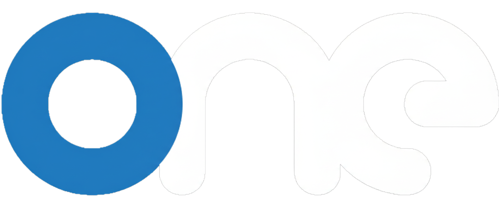

# FacultyOne

FacultyOne is a secure academic cloud platform built exclusively for educators.  
It enables professors and faculty members to store, manage, and access teaching materials seamlessly — anytime, anywhere, including live classroom environments.

---

## 🚧 Project Status: Under Deep Development

FacultyOne is currently in **deep and active development**.  
Core features, architecture, and security systems are being designed and implemented.  
The platform is **not production-ready yet** and is evolving rapidly.

---

## 🚀 Overview

FacultyOne addresses a common challenge in education:  
fragmented files, unsafe storage, and difficulty accessing teaching materials across devices and classrooms.

The platform provides every verified educator with a **personal academic cloud** to securely store and organize PPTs, lecture notes, PDFs, and other academic resources — all in one place.

---

## 🎯 Intended Users

- Professors & Lecturers  
- Teachers & Academic Staff  
- Educational Institutions  
- Faculty using smart boards, projectors, or shared classroom systems  

---

## ✨ Planned & In-Progress Features

### ☁️ Personal Academic Cloud
Each registered educator will receive a dedicated cloud space for academic materials.

### 📂 Smart File Organization
Files can be organized by subject, semester, course, or topic for quick access during lectures.

### ⚡ Fast Upload & Instant Access
Access teaching materials from:
- Laptops
- Smart boards
- Classroom systems
- Personal devices

### 🔐 Secure & Encrypted Storage
All stored data will be protected with encryption and strict access control.

### 🧑‍🏫 Faculty-Only Access
Only verified educators will be allowed. Every account will go through an approval process.

### 🔑 Temporary Classroom Login (In Design)
Educators will be able to generate **temporary, limited-use login credentials** to access their materials on classroom systems or smart boards — without exposing their main account credentials.

### 🧾 Approval-Based System
Accounts will be reviewed before activation to maintain platform trust and quality.

---

## 📝 Planned Workflow

1. Educator registers on FacultyOne  
2. Account goes through verification & approval  
3. After approval, the educator can:
   - Upload teaching resources
   - Organize academic files
   - Access materials from any device
4. Temporary classroom login credentials can be generated for live sessions  
5. Temporary credentials expire automatically after use  

---

## 🎁 Free Storage (Planned)

- 500 MB free cloud storage for approved accounts  
- No credit card required  
- Data remains private and secure  

---

## 🛠️ Tech Stack (Planned / In Progress)

- Frontend: React  
- Styling: Custom modern UI with CSS  
- Backend: In development  
- Authentication: Secure credential-based system  
- Storage: Cloud-based file storage  
- Security: Encrypted access & role-based permissions  

---

## 🗺️ Development Roadmap

- Core authentication & approval system  
- File upload and cloud storage  
- Smart file organization  
- Temporary classroom login system  
- Institution-level access (future)  
- Student view-only access (future)  

---

## 🤝 Contributions

FacultyOne is in an early and active development phase.  
Ideas, feedback, and discussions are welcome once the core system stabilizes.

---

## 📄 License

MIT License

---

## 👨‍💻 Author

Developed by **Sanket Padhyal**  
GitHub: `@sanketpadhyal`

---

**FacultyOne — One secure cloud for every educator.**
