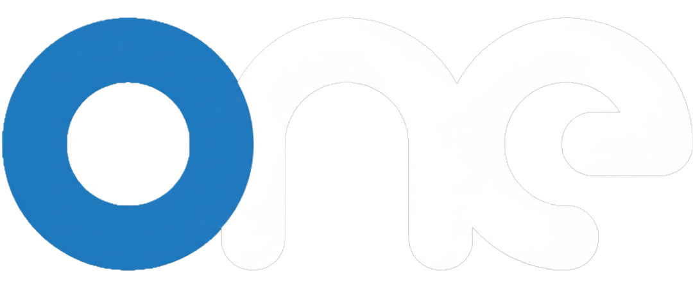

# FacultyOne

**Secure Academic Cloud Platform for Educators**

🌐 Live Website: [https://facultyone.cloud](https://facultyone.cloud)

---

> 🚀 **Latest Update:** FacultyOne is now running on **Google Cloud infrastructure** for high reliability and zero downtime issues.
> 💡 **Upcoming Upgrade:** The **Basic (Free) plan will be increased to 600 MB storage** in future updates.

---

## 🚀 About FacultyOne

FacultyOne is a secure academic cloud platform built exclusively for educators.

It enables verified faculty members to store, manage, and access teaching materials from any device — including live classroom systems, projectors, and smart boards.

The platform eliminates unsafe practices like USB drives, shared logins, and personal cloud usage on public systems by introducing:

• One-time classroom access tokens
• Encrypted cloud storage
• Session-based secure access

---

## 🎯 Why FacultyOne?

Educators often face:

* Carrying pendrives
* Logging into personal drives on public PCs
* Emailing files to themselves
* Data leaks and account risk

FacultyOne solves this with:

✅ Secure cloud storage
✅ Temporary classroom sessions
✅ Auto-expiring access tokens
✅ Verified educator-only access

---

## ✨ Key Features

### ☁️ Personal Academic Cloud

Private storage for each approved educator.

### 🔑 One-Time Classroom Access

Generate secure tokens to open files on classroom systems without revealing login credentials.

### 📂 Smart File Management

Organize resources by subject, course, or semester.

### 🔐 Encrypted File Access

Files are accessed via signed URLs and protected sessions.

### 🧑‍🏫 Approval-Based Platform

Only verified educators are allowed.

### ⚡ Optimized for Classrooms

Fast, responsive, and works smoothly on PCs, smart boards, tablets, and mobile devices.

---

## 📝 How It Works

1. Educator registers on FacultyOne
2. Admin reviews & approves account
3. Educator uploads academic materials
4. Educator generates up to 5 temporary classroom access tokens
5. Token is used once to open a secure classroom session and is immediately invalidated
6. Files open securely within the session and cannot be reused

---

## 💾 Storage Plans

### 🆓 Basic Plan (Free)

* 100 MB secure academic cloud storage
* Private & encrypted

### ⭐ Premium Plan (Selected Educators)

* 600 MB cloud storage
* Priority access & future upgrades

> 🚀 **Update:** In future updates, the Basic (Free) plan will be upgraded to **600 MB storage** as infrastructure scales.

---

## 📊 Scalability & Performance

FacultyOne is fully optimized for production use and now running on **Google Cloud infrastructure**, ensuring high reliability and minimal downtime.

Current capacity:

✅ 1,000+ users supported easily
✅ Scalable to 5,000+ users with upgraded cloud resources
✅ Secure token-based classroom sessions
✅ No downtime issues with cloud-backed deployment

The platform architecture is designed to scale massively without core changes.

---

## 🔒 Security Model

* Firebase authentication for verified user access
* Supabase secure storage integration
* Session-based access control
* Signed time-limited file URLs
* Role-based admin permissions

> Currently the storage bucket is operating in public mode for early-stage deployment, but files remain protected through signed expiring URLs and secure session layers.

> Once user volume grows and initial funding is arranged, the storage system will be migrated to fully private backend-controlled buckets with no architectural changes required.

---

## 🛠️ Tech Stack

### Frontend

* React
* Custom modern responsive UI

### Authentication

* Firebase Auth

### Database & Storage

* Supabase

### Infrastructure

* Google Cloud (Production deployment & scaling)

### Security

* Token-based sessions
* Signed file access
* Role-based permissions

---

## 🔐 Admin Backend

FacultyOne includes a dedicated Admin Portal.

Administrators can:

* Approve or reject educator accounts
* Manage user plans
* Control storage limits
* Monitor platform activity
* Review system performance

This ensures platform trust, security, and controlled scaling.

---

## 🗺️ Roadmap

* Institution-level dashboards
* Student view-only classroom sessions
* Expanded storage tiers
* Mobile application
* Advanced analytics and reporting

---

## 🤝 Contributions

FacultyOne is under active development.

Feedback, ideas, and contributions are welcome.

---

## 👨‍💻 Author

Developed by **Sanket Padhyal**
GitHub: [https://github.com/sanketpadhyal](https://github.com/sanketpadhyal)

---

📅 Project Started: January 31, 2026
🚀 Current Status: Production ready, fully functional, and actively scaling
